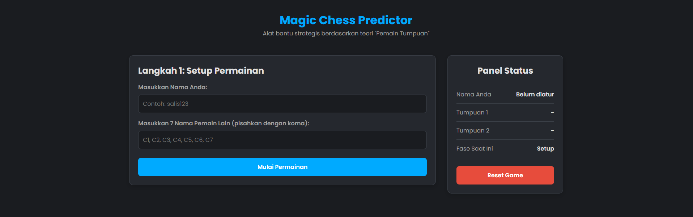

# ♟️ Magic Chess Opponent Predictor

A web-based strategic tool to predict opponents in the game Magic Chess, based on in-depth analysis and the "Anchor Player" theory.

---

## 📜 About The Project

This project was born out of research and curiosity about the matchmaking algorithm in Magic Chess. After recording and analyzing several games, it was discovered that the opponent matching system is **not entirely random**, but rather follows a complex, predictive pattern.

This tool is an implementation of the **"Anchor Player" Theory**, which allows players to know who their opponents will be in several upcoming matches by recording information from the initial rounds. The goal is to provide a strategic advantage, enabling players to better manage their positioning and preparations.

---

## ✨ Key Features

- **Intuitive Data Input:** An easy-to-understand input flow, starting with your name and the other 7 players.
- **Accurate Predictions:** Implements the "Anchor Player" rules to predict opponents in **Match 3, 5, 6, and 7**.
- **Real-time Status Panel:** A persistent sidebar that keeps track of the Anchor Players who are key to the predictions.
- **Match Summary:** After 7 matches, the application displays a complete history of the opponents you have faced.
- **Web-based & Offline:** Built with pure HTML, CSS, and JavaScript. Simply open the `index.html` file in a browser, and the application is ready to use, no internet connection required.

---

## 🚀 How to Use

1.  **Download the Project:** Click the green `▼ Code` button on this GitHub page, then select `Download ZIP`.
2.  **Extract the Files:** Extract the ZIP file you downloaded to a folder on your computer.
3.  **Open the Application:** Go into the folder and double-click the **`index.html`** file. The application will automatically open in your default browser.
4.  **Follow the Steps:** Input the game data as prompted on the screen to see the predictions.

---

## 🧠 The "Anchor Player" Theory Explained

The prediction logic behind this tool is based on the first two opponents you face. They become "Anchors" for subsequent predictions.

1.  **Anchor 1 (A1):** Is the opponent you face in **Match 1**.
2.  **Anchor 2 (A2):** Is the opponent you face in **Match 2**.
3.  **Opponent Predictions:**
    - **Match 3:** You will face the player who was **A1's** opponent in Match 2.
    - **Match 5:** You will face the player who was **A1's** opponent in Match 4.
    - **Match 6:** You will face the player who was **A2's** opponent in Match 5.
    - **Match 7:** You will face the player who was **A1's** opponent in Match 6.

---

## 🛠️ Built With

- **HTML5:** For content structure.
- **CSS3:** For modern styling, Grid layout, and responsiveness.
- **JavaScript (ES6):** For all interactive logic and the prediction mechanism.

---

## 🤝 Contributing

Contributions, issues, and feature requests are welcome! Feel free to fork this repository and create a pull request.

1.  Fork the Project.
2.  Create your Feature Branch (`git checkout -b feature/AmazingFeature`).
3.  Commit your Changes (`git commit -m 'Add some AmazingFeature'`).
4.  Push to the Branch (`git push origin feature/AmazingFeature`).
5.  Open a Pull Request.

---

## 🙏 Acknowledgments

-   Thanks to the Magic Chess community, which is always full of interesting strategies.
-   This project was created and the theory was discovered by **[Tsalis Sholeh Al Akbar]**.